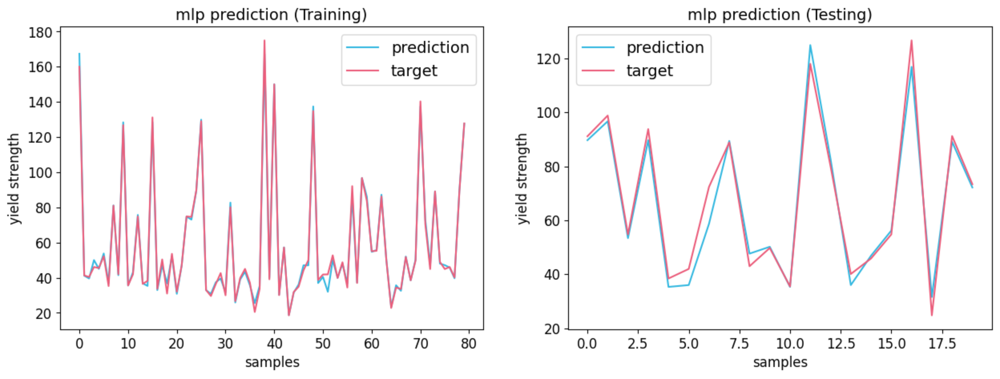
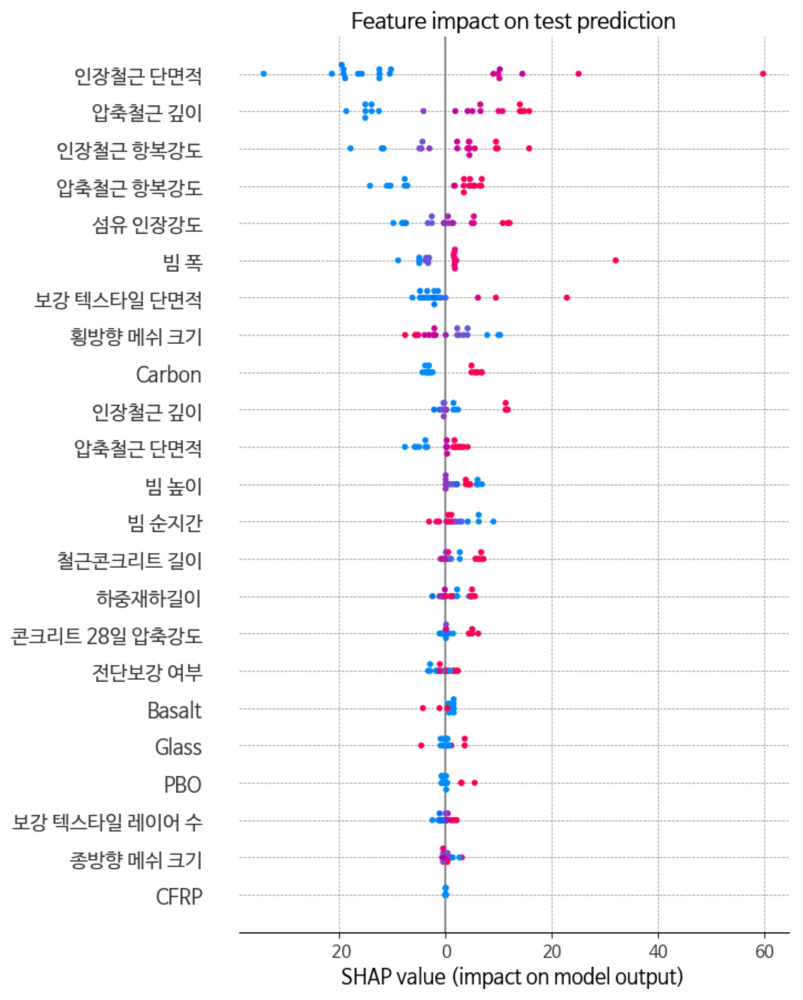
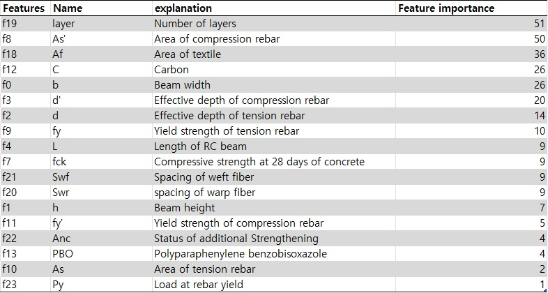
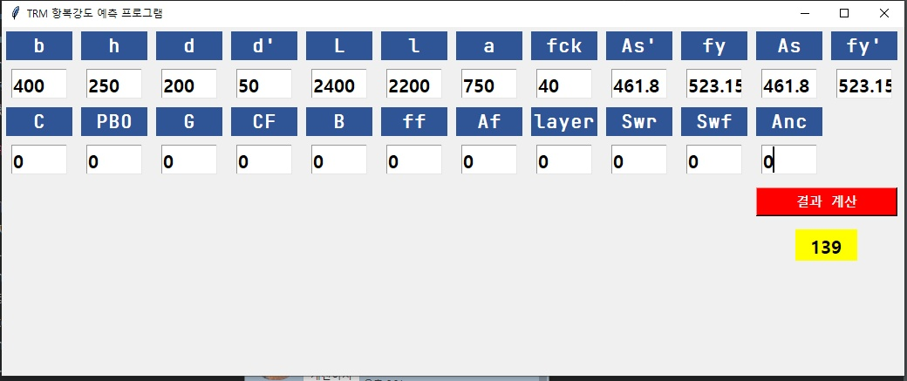

# TRM_strength_prediction

### Published paper
**Title**: "Predicting the Flexural Strength of Textile Reinforced Mortar(TRM) Strengthened RC Beams Using Machine Learning Model"

**Author**: Jong Ho Park, Sun-Kyu Park, Dong-Uk Kang, Dong Young Ko, Young Jae Song, Seung Hee Park

**Journal**: KOREAN SOCIETY OF CIVIL ENGINEERS

**DOI**: [https://doi.org/10.1016/j.conbuildmat.2022.129560](https://www.dbpia.co.kr/journal/articleDetail?nodeId=NODE11223392)

### Abstract
Textile  reinforced  mortar  (TRM)  보강  공법은  유리섬유와  탄소섬유  등의  복합소재  직조물(텍스타일, textile)을  무기계  매트릭스에  사용하여  철근콘크리트(RC)  구조물을  보강하는  기술이다.  이때  텍스타일은  메 쉬  형태의  구조를  가지게  되는데,  이러한  구조적  특성으로  인하여 재료  물성치  외에  다양한  요인들이  보강된 RC  보의  휨  거동에  큰  영향을  끼치게  된다.  다양한  요인들을  고려하기  위한  적합한  방법으로  최근  인공지능 을  활용한  성능  예측이  고려되고  있다.  그러나  데이터  수집  및  적용  사례가  적어  검증이  부족한  상황이다. 본  연구에서는  multi  layer  perceptron  (MLP)  및  extreme  gradient  boosting  (xgBoost)  머신러닝  모델을  통 해  TRM으로  보강된 철근콘크리트  보의  휨 강도를  예측하고  우수한 성능을  확인하였다.

### Figures

This repository contains the code(not providing dataset) for the following paper.
### Published paper
**Title**: "Analysis of load-bearing capacity factors of textile-reinforced mortar using multilayer perceptron and explainable artificial intelligence"

**Author**: Youngjae Song, Kwangsu Kim, Seunghee Park, Sun-Kyu Park, Jongho Park

**Journal**: Construction and Building Materials

**DOI**: https://doi.org/10.1016/j.conbuildmat.2022.129560

### Abstract
>With the aging of reinforced concrete structures, textiles, which are fiber composite materials, have been gaining attention for structural strengthening and replacement of steel reinforcements. The application of textile- reinforced mortar (TRM) is one method of strengthening structures using textiles. Various factors affect the performance when structures are strengthened with TRM; it is affected by the physical properties of the material, such as tensile strength and elongation, and external factors, which vary depending on the design condition, such as textile geometry and strengthening method. Therefore, it is necessary to develop an accurate method that considers the influence of various external factors for evaluating the load-bearing capacity in flexural of TRM- strengthened RC beam. A total of 100 experimental data were learned using a multilayer perceptron (MLP) deep learning model with 24 features, which were analyzed using explainable artificial intelligence, shapley additive explanations (SHAP). The MLP model exhibited a high performance, with a coefficient of determination of 0.9677, indicating the complex correlation between the given features. Regarding the influence of external factors on yield strength, the weft fiber spacing had a negative impact with high influence, and the warp fiber spacing was found to have a very low effect. The anchorage and the number of layers seemed to have a positive impact; however, the effect was small.

### Figures

### GUI.py usage

